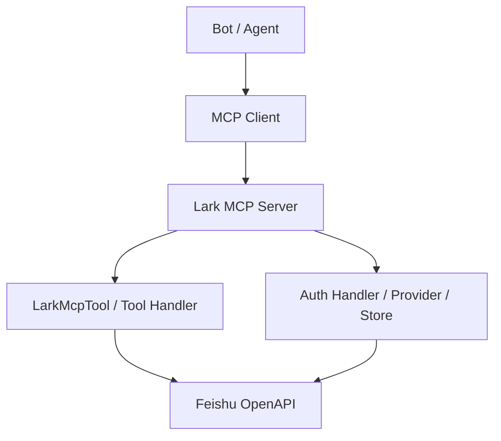
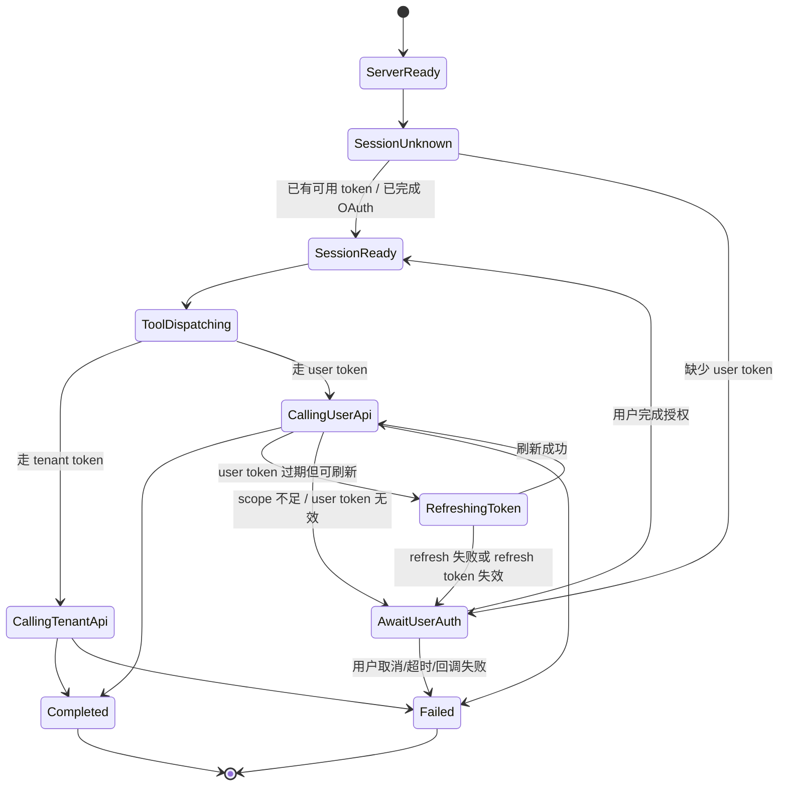
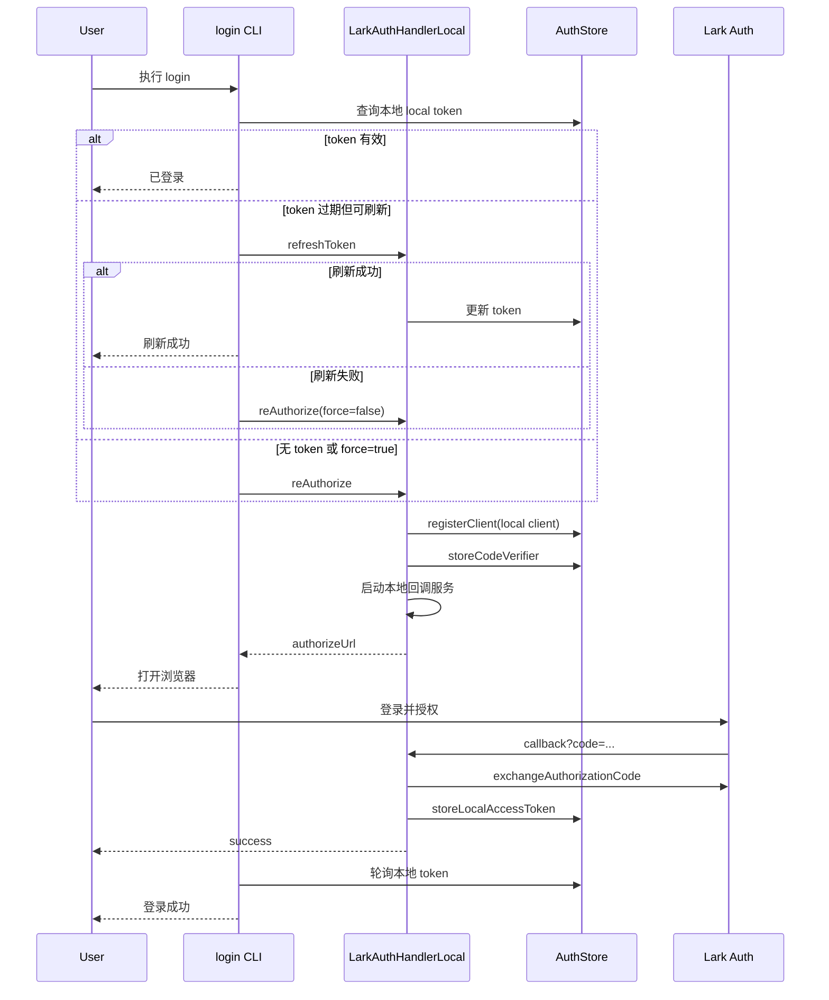
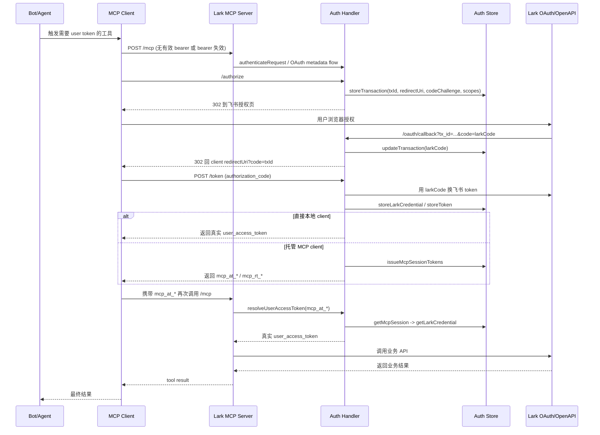
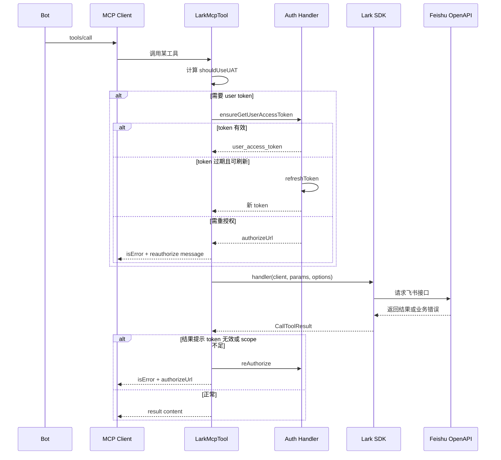

# 飞书 MCP Bot 视角端到端流程设计思路

## 1. 文档目标

本文从一个“正在调用飞书 MCP 的 Bot/Agent”视角，完整描述从：

1. MCP Server 启动
2. 工具暴露
3. MCP 会话建立
4. OAuth 认证
5. 工具调用
6. 飞书 OpenAPI 请求
7. 正常返回
8. 各类异常处理与重试/重授权

直到一次工具调用结束的全流程。

本文不是通用 MCP 教程，而是结合当前仓库实现，对以下模块进行统一抽象：

- `src/cli.ts`
- `src/mcp-server/shared/init.ts`
- `src/mcp-server/transport/*.ts`
- `src/auth/**/*`
- `src/mcp-tool/**/*`

目标是让后续设计、重构、接入 Agent 平台时，能明确回答下面几个问题：

- Bot 在什么时机知道“自己能调用哪些工具”？
- Bot 在什么时机需要用户授权？
- MCP Session Token 和飞书 User Access Token 的关系是什么？
- 正常消息和异常消息分别沿哪条链路传播？
- 哪些错误应该重试，哪些错误必须重新授权，哪些错误应该直接失败？
- 多用户托管 OAuth 模式下，服务端如何隔离不同用户的会话和凭证？

---

## 2. 设计范围与非范围

### 2.1 范围

- `stdio`、`sse`、`streamable` 三种传输模式
- 本地单用户授权模式
- 托管 OAuth 的 HTTP MCP 服务模式
- tenant token 与 user token 混用场景
- MCP 协议层消息
- OAuth 层消息
- 工具层消息
- 业务异常、协议异常、认证异常、存储异常

### 2.2 非范围

- 不展开每一个飞书 API 的业务参数
- 不展开具体 Agent Prompt 设计
- 不展开前端 UI 设计，仅描述浏览器跳转与回调

---

## 3. 角色与核心对象

从 bot 视角，可以把系统拆成 7 个角色。

| 角色 | 职责 |
| --- | --- |
| Bot / Agent | 决定何时调用 MCP 工具，并解释结果 |
| MCP Client | 与 MCP Server 建立协议连接，发起 `tools/list`、`tools/call` 等请求 |
| Lark MCP Server | 暴露工具、承接协议消息、转发认证/工具调用 |
| Auth Handler | 管理 OAuth 路由、Bearer 校验、token 刷新、重授权 |
| Auth Store | 保存 client、transaction、飞书凭证、MCP session |
| Lark OAuth Provider | 把 MCP OAuth 流程桥接到飞书 OAuth / OIDC |
| Feishu/Lark OpenAPI | 最终业务 API 的执行方 |

当前实现里的关键“令牌”有 4 类，必须严格区分：

| 令牌 | 所属层 | 作用 |
| --- | --- | --- |
| `tenant_access_token` | 飞书业务层 | 以应用身份调用 API |
| `user_access_token` | 飞书业务层 | 以用户身份调用 API |
| `mcp_at_*` | MCP 服务层 | 客户端访问 MCP Server 的 access token |
| `mcp_rt_*` | MCP 服务层 | 客户端刷新 MCP session 的 refresh token |

一个非常关键的设计点：

`mcp_at_*` 不能直接调用飞书 OpenAPI，它只是用来访问 MCP Server；MCP Server 再通过 `credentialId` 找到真正的飞书 `user_access_token`。

---

## 4. 总体架构与分层

从 bot 看，一次调用分成 4 层：

1. 协议层：MCP/JSON-RPC/HTTP/stdio
2. 认证层：OAuth、Bearer、session、refresh、reauthorize
3. 工具层：tool schema、token mode、handler 分发
4. 业务层：飞书 OpenAPI 请求与响应



设计上，Server 并不直接把飞书认证细节暴露给 Bot，而是做两层封装：

- 协议层对 Bot 暴露统一的 MCP tool 调用接口
- 认证层对 Bot 暴露“可继续调用 / 需要重授权 / 需要重新连接”这几类有限状态

这意味着一个成熟 bot 不应该把所有错误都当成“API 失败”，而应该识别错误来源。

---

## 5. Bot 视角的状态机

建议把 bot 的内部状态抽象成下面这组状态。



Bot 的核心策略应该是：

- 优先判断这是“协议问题”“认证问题”还是“业务问题”
- 能静默恢复的先静默恢复
- 需要用户参与时，给出明确、可执行、一次性的信息
- 不把底层 token、session、transaction 混为一谈

---

## 6. 启动阶段设计

### 6.1 CLI 启动入口

`lark-mcp` 当前有几种关键命令：

- `login`
- `logout`
- `whoami`
- `mcp`
- `recall-developer-documents`

其中和 bot 调用主链路最相关的是 `mcp`。

### 6.2 MCP Server 初始化

`initMcpServerWithTransport` 做了三件事：

1. 校验参数组合是否合法
2. 构造新的 MCP Server 实例
3. 根据 transport 选择 `stdio` / `sse` / `streamable`

关键约束：

- `userAccessToken` 与 `oauth` 不能同时使用
- `oapi` server 才需要完整 auth flow
- `recall` server 不走飞书业务 OAuth

### 6.3 工具集生成

`initOAPIMcpServer` 会：

1. 校验 `appId` / `appSecret`
2. 展开 preset tool 列表
3. 创建 `McpServer`
4. 创建 `LarkMcpTool`
5. 按语言、tool preset、token mode 过滤工具
6. 注册到 MCP Server

这里对 bot 的意义是：

- Bot 看到的工具列表，已经不是全量飞书 API，而是经过 preset 和 token mode 过滤后的结果
- 如果 `tokenMode=user_access_token`，只会留下支持 user token 的工具
- 如果 `tokenMode=tenant_access_token`，只会留下支持 tenant token 的工具
- 如果 `tokenMode=auto`，工具层面允许更宽，是否使用 UAT 由调用参数和工具语义共同决定

---

## 7. 认证设计总览

当前仓库实际上支持两种用户身份模式。

### 7.1 模式 A：本地单用户模式

特点：

- 先执行 `login`
- 浏览器在本机回调 `http://localhost:3000/callback`
- 本地保存真正的飞书 `user_access_token`
- MCP Server 在后续工具调用时直接复用本地 token

适用场景：

- 本机开发
- 单用户桌面环境
- Agent 与用户是同一台机器

### 7.2 模式 B：托管 OAuth 模式

特点：

- MCP Server 以 HTTP 服务运行
- 用户在浏览器完成授权
- 服务端保存真实飞书凭证
- 客户端仅持有 `mcp_at_*` / `mcp_rt_*`
- 每次工具调用时由服务端解析 MCP session，再映射到真实飞书 token

适用场景：

- 内网服务
- 多用户共享同一 MCP 服务
- 不希望把飞书 refresh token 下发给客户端

### 7.3 模式差异总结

| 项目 | 本地单用户 | 托管 OAuth |
| --- | --- | --- |
| 浏览器回调地址 | 本机 localhost | 服务端公网/内网可达地址 |
| token 保存位置 | 本机 Auth Store | 服务端 Auth Store |
| client 持有 | 真实飞书 user token 的间接引用 | MCP session token |
| 多用户支持 | 弱 | 强 |
| 服务重启后恢复 | 依赖本机持久化 | 强依赖持久化 |

---

## 8. 本地单用户认证流程

### 8.1 触发方式

用户先执行：

```bash
lark-mcp login -a <app_id> -s <app_secret>
```

### 8.2 本地登录主流程



### 8.3 Bot 视角下的重要结论

- `login` 完成后，bot 实际上并不直接拿到 user token
- bot 后续通过 `appId -> localTokens[appId] -> tokens[token]` 间接获得 token
- 如果 token 有 refresh token，可静默刷新
- 如果刷新失败，bot 应引导重新浏览器授权，而不是继续盲重试工具调用

### 8.4 本地模式异常点

| 场景 | 表现 | bot 应对 |
| --- | --- | --- |
| 未配置回调地址 | 浏览器能打开，但回调失败 | 明确提示去开发者后台配置 redirect URI |
| 本地端口被占用 | 本地授权服务起不来 | 提示更换 `--port` 或释放端口 |
| 60 秒超时 | CLI 轮询不到 token | 终止并提示重新登录 |
| refresh token 失效 | 静默刷新失败 | 进入 reauthorize |
| 用户取消授权 | callback 携带 `error` | 直接结束并保留原因 |

---

## 9. 托管 OAuth 模式设计

这是最需要从 bot 视角重点设计的部分，因为它是“真正的多轮 agent 交互场景”。

### 9.1 服务端启动前提

当 `streamable` 或 `sse` 且启用了 `--oauth` + `--public-base-url` 时，系统会强制检查持久化存储是否就绪。

原因：

- 托管模式必须保存 client 注册信息
- 必须保存 MCP session
- 必须保存飞书 credential
- 必须保存 transaction

如果服务重启丢失这些状态，多用户会话就无法恢复，refresh 也无法继续，安全边界会被破坏。

### 9.2 托管 OAuth 主链路



### 9.3 核心抽象：Transaction、Credential、Session

三者不要混淆。

#### Transaction

授权中间态，短生命周期。

包含：

- `txId`
- `clientId`
- `redirectUri`
- `callbackUrl`
- `state`
- `codeChallenge`
- `scopes`
- `larkCode`
- `expiresAt`
- `consumedAt`

职责：

- 承接“客户端 OAuth 请求”和“飞书回调”之间的桥
- 把飞书返回的 `code` 变成客户端可用的临时 authorization code

#### Lark Credential

真实飞书凭证，代表一个用户在某个 app 下的授权结果。

包含：

- `credentialId`
- `accessToken`
- `refreshToken`
- `appId` / `appSecret`
- `scopes`
- `expiresAt`
- `refreshExpiresAt`
- `userInfo`

职责：

- 作为服务端长期保存的真实用户授权状态
- 被一个或多个 MCP session 间接引用

#### MCP Session

客户端看见的“访问 MCP 服务”的会话。

包含：

- `mcp_at_*`
- `mcp_rt_*`
- `credentialId`
- `scopes`
- `expiresAt`
- `refreshExpiresAt`

职责：

- 隔离客户端和真实飞书 token
- 支持 session 轮转、过期控制、独立 refresh

---

## 10. Tool 调用主流程

### 10.1 Bot 视角的标准调用路径

1. Bot 决定调用某个飞书工具
2. MCP Client 发起 `tools/call`
3. Server 找到对应 tool handler
4. 根据 `tokenMode + params.useUAT + tool.accessTokens` 判定走 tenant 还是 user
5. 如果需要 user token，先做 token 有效性检查
6. 必要时 refresh 或 reauthorize
7. 调用飞书 SDK / fallback request
8. 返回 MCP `CallToolResult`

### 10.2 工具执行分发

当前工具执行时有两层分发：

#### 第一层：是否需要 user token

`getShouldUseUAT(tokenMode, params.useUAT)` 的规则：

- `user_access_token` 模式：强制 `true`
- `tenant_access_token` 模式：强制 `false`
- `auto` 模式：看 `params.useUAT`

#### 第二层：使用哪个 handler

- 优先 `tool.customHandler`
- 否则走统一 `larkOapiHandler`

### 10.3 执行时序



---

## 11. 正常消息处理机制

从 bot 的角度，正常消息处理包含三类“正常”：

1. 协议正常
2. 认证正常
3. 业务正常

### 11.1 协议正常

`streamable` 模式下，HTTP 请求必须满足：

- `POST /mcp`
- `Accept` 同时包含 `application/json` 和 `text/event-stream`
- `Content-Type` 为 `application/json`

满足后，服务端会：

1. 构造 per-request `McpServer`
2. 连接 `StreamableHTTPServerTransport`
3. 调用 `transport.handleRequest(req, res, req.body)`

这意味着：

- 每个 HTTP 请求的服务实例是短生命周期的
- 连接关闭时会 `transport.close()` 和 `server.close()`
- 对 bot 来说，请求上下文是天然隔离的

### 11.2 认证正常

有三条典型正常认证链路：

#### 链路 A：tenant token 直接调用

- 不需要用户参与
- 不需要 OAuth session
- 适合应用级资源

#### 链路 B：已有有效 user token

- 直接从本地 store 或 session 映射取到
- 无感知调用

#### 链路 C：user token 过期但可刷新

- 在工具执行前先 refresh
- 对 bot 来说通常是一条“隐形成功路径”

### 11.3 业务正常

无论底层 SDK 返回什么结构，当前统一包装为：

```json
{
  "content": [
    {
      "type": "text",
      "text": "{...json string...}"
    }
  ]
}
```

这意味着 bot 侧建议做两步处理：

1. 先判断 `isError`
2. 再尝试解析 `content[0].text` 的 JSON

不要假设所有工具返回完全一致的业务字段，但可以假设外层 MCP 包装基本一致。

---

## 12. 异常消息处理机制

这是本文最重要的部分。

为了让 bot 可控，建议把异常分成 5 层。

### 12.1 第 1 层：HTTP / 传输层异常

主要发生在 `streamable`、`sse` 模式。

#### 典型场景

| 场景 | HTTP 状态 | 返回特征 |
| --- | --- | --- |
| `Accept` 不合法 | `406` | `lark_mcp_error=invalid_accept_header` |
| `Content-Type` 不合法 | `415` | `lark_mcp_error=invalid_content_type` |
| `GET /mcp` 或 `DELETE /mcp` | `405` | `lark_mcp_error=method_not_allowed` |
| sessionId 不存在（SSE） | `400` | 明文错误 |
| 服务启动失败 | 进程退出 | 无 MCP 响应 |

#### bot 处理建议

- 这类错误不应重试业务逻辑
- 应先修正 client/transport 行为
- 对终端用户应表现为“连接配置错误”，而不是“飞书接口失败”

### 12.2 第 2 层：OAuth 协议异常

主要出现在 `/authorize`、`/token`、`/callback`。

#### 典型错误码

- `invalid_client`
- `invalid_grant`
- `invalid_request`
- `pkce_required`
- `reauth_required`
- `server_error`

#### 典型场景

| 场景 | 说明 | 结果 |
| --- | --- | --- |
| 未传 PKCE | `/authorize` 缺少 `code_challenge` | 400 |
| PKCE method 不是 `S256` | 不支持其他 method | 400 |
| redirect_uri 未注册 | client 和 redirect 不匹配 | 400 / browser error |
| transaction 不存在 | tx 过期或丢失 | callback 失败 |
| authorization code 重复使用 | `consumedAt` 已存在 | `invalid_grant` |
| refresh token 已失效 | 飞书拒绝 refresh | `reauth_required` |

#### bot 处理建议

- `invalid_request`：客户端实现问题，直接失败并修复调用参数
- `invalid_client`：注册信息或回调配置问题，需人工修复
- `invalid_grant`：本次授权上下文已无效，重新走完整授权
- `reauth_required`：直接引导用户重新授权，不再继续 refresh 重试

### 12.3 第 3 层：认证状态异常

这是 bot 最常遇到的一层。

#### 场景 A：当前没有 user token

表现：

- `ensureGetUserAccessToken()` 取不到 token
- 或 `resolveUserAccessToken(mcp_at_*)` 映射不到真实 credential

处理：

- 进入授权流程
- 如果是工具调用期间发生，返回重授权指令

#### 场景 B：token 过期但 refresh 成功

表现：

- 无最终错误
- 中间经过 refresh

处理：

- bot 对用户通常不需要提示

#### 场景 C：token 过期且 refresh 失败

表现：

- 最终返回 reauthorize message
- 包含 `authorizeUrl`

处理：

- 让用户重新授权
- 不要继续重试同一个工具请求

#### 场景 D：token scope 不足

仓库中专门识别了飞书错误码：

- `99991679`：`USER_ACCESS_TOKEN_UNAUTHORIZED`
- `99991668`：`USER_ACCESS_TOKEN_INVALID`

当工具调用返回这些错误码时，`LarkMcpTool` 会再次触发 `reAuthorize()`，并把“重授权提示”封装成 tool error 返回。

这意味着 bot 不应该只看 HTTP 200，而要看 tool result 的 `isError` 和错误内容。

### 12.4 第 4 层：工具执行异常

工具层异常来自两部分：

#### 类型 A：handler 内部异常

例如：

- `sdkName` 无效
- 客户端未初始化
- custom handler 抛异常

结果：

- 返回 `isError: true`
- `content[0].text` 是错误消息 JSON 字符串

#### 类型 B：飞书 API 业务错误

例如：

- 参数错误
- 权限不足
- 资源不存在
- 速率限制

结果：

- 被 handler 捕获
- 转成统一 MCP error content

bot 处理建议：

- 可恢复的业务错误：提示用户修正参数
- 权限/认证类错误：走 reauth 分类
- 不要把所有 `isError=true` 都当成系统崩溃

### 12.5 第 5 层：存储与服务端状态异常

这类问题在托管模式非常关键。

#### 典型场景

| 场景 | 后果 |
| --- | --- |
| 持久化存储初始化失败 | Hosted OAuth 应拒绝启动 |
| 加密能力不可用 | token 无法安全落盘 |
| storage 文件损坏 | 会导致 token/client/session 丢失 |
| 服务重启后状态缺失 | session 无法映射到 credential |

#### 设计原则

- 本地内存降级可以接受，但托管 OAuth 不允许“伪成功”
- 对 hosted 模式必须 fail fast
- 比起带病运行，更应该明确拒绝启动

---

## 13. 重授权消息设计

当前实现中，工具层会把“需要重新授权”包装成一个结构化文本消息。

其语义大致包括：

- `errorCode`
- `errorMessage`
- `instruction`
- `rawErrorText`

其中 `instruction` 可能包含：

- 浏览器授权 URL
- 当前 callback URL
- 去飞书后台配置回调地址的提示
- 链接 60 秒有效的说明

### 13.1 bot 应如何消费这类消息

建议：

1. 先解析 JSON
2. 判断是否包含 `authorizeUrl` 类信息
3. 把这类错误升级为“需要用户完成动作”
4. 暂停当前多步自动化，而不是继续盲目调用后续依赖 user token 的工具

### 13.2 不建议的做法

- 看到错误后连续重试同一工具
- 忽略 instruction，直接只显示 “token invalid”
- 继续使用旧 session 反复请求

---

## 14. 不同 transport 的 bot 交互差异

### 14.1 `stdio`

特点：

- 适合桌面类 MCP Client
- server 生命周期通常跟随 client 进程
- 本地模式下易于直接配合 `login`

bot 感知：

- 更像“本机插件”
- 授权失败通常是本机浏览器/回调问题

### 14.2 `sse`

特点：

- 兼容旧式 HTTP + sessionId 模式
- 当前仓库已明确标记 deprecated

bot 感知：

- 有 `/sse` 建链和 `/messages` 发送的双通道心智负担
- 新设计不建议继续作为主要模式

### 14.3 `streamable`

特点：

- 当前推荐模式
- `POST /mcp` 为核心入口
- 对 HTTP 头校验更严格
- 请求结束即回收 transport/server

bot 感知：

- 协议边界清晰
- 更适合托管、多用户、云端 agent

---

## 15. Bot 端建议的错误分类器

如果后续要做一个真正健壮的飞书 Agent，建议在 bot 侧做统一错误分类。

### 15.1 分类建议

| 分类 | 识别信号 | bot 动作 |
| --- | --- | --- |
| `transport_error` | HTTP 405/406/415、连接失败 | 修复 MCP 连接，不重试业务 |
| `oauth_request_error` | `invalid_request` / `pkce_required` | 修复 OAuth 请求 |
| `reauth_required` | `reauth_required`、tool 返回 authorize instruction | 请求用户重新授权 |
| `token_invalid` | 飞书错误码 `99991668` | 重新授权或重连 |
| `token_scope_missing` | 飞书错误码 `99991679` | 提示补权限并重新授权 |
| `business_error` | API 返回业务错误 | 让用户修正参数/资源 |
| `server_state_error` | session/credential/transaction 缺失 | 重新建立会话，必要时排查服务端存储 |

### 15.2 推荐恢复策略

| 错误类型 | 是否自动重试 | 是否需要用户动作 |
| --- | --- | --- |
| 网络瞬时失败 | 可以有限重试 | 否 |
| refresh 失败 | 不继续业务重试 | 是 |
| scope 不足 | 否 | 是 |
| transaction 过期 | 否 | 是 |
| 参数错误 | 否 | 可能 |
| server 初始化失败 | 否 | 是 |

---

## 16. 关键边界条件与场景预判

这里列出从 bot 视角最应该预判的场景。

### 场景 1：Bot 调用了 user-only 工具，但当前只有 tenant 语义

表现：

- 工具层会尝试获取 user token
- 若无 token，则进入 reauthorize

设计建议：

- Bot 在规划阶段就应识别工具是否 user-only
- 避免把“读取用户私有文档”与“应用级查询”混在同一条无授权链路里

### 场景 2：Bot 连续调用多个需要同一用户身份的工具

表现：

- 第一个工具可能触发授权
- 后续工具应复用同一 credential / session

设计建议：

- 将“等待授权”视作流程断点
- 授权完成后恢复后续步骤，而不是从头重新规划全部链路

### 场景 3：Bot 在长链路中遇到 session 过期

表现：

- MCP session refresh
- 或真实飞书 credential refresh

设计建议：

- 工具调用前做短路校验
- 避免先执行昂贵推理、最后才发现 token 已失效

### 场景 4：服务端重启后 session 丢失

表现：

- `mcp_at_*` 无法映射到 credential
- `resolveUserAccessToken` 失败

设计建议：

- 客户端收到这类错误时，应优先 refresh MCP session
- refresh 仍失败，则走完整 OAuth

### 场景 5：飞书后台权限变更

表现：

- 原本可用的 user token 突然 scope 不足
- 触发 `99991679`

设计建议：

- Bot 给出的提示不能只说“token 过期”
- 应明确提示“应用权限或用户授权范围发生变化，需要补齐权限后重新授权”

### 场景 6：Hosted OAuth 存储不可用

表现：

- 服务启动阶段失败

设计建议：

- 这是部署错误，不是运行期业务错误
- 应在运维层兜底，而不是在 bot 对话中反复解释

---

## 17. 建议的消息语义规范

为了让 bot 更稳定，建议后续围绕现有实现补充一层更明确的消息语义。

### 17.1 工具结果建议统一区分三态

#### 成功

```json
{
  "ok": true,
  "recoverable": false,
  "category": "success",
  "data": {}
}
```

#### 可恢复错误

```json
{
  "ok": false,
  "recoverable": true,
  "category": "reauth_required",
  "action": "open_authorize_url",
  "authorize_url": "..."
}
```

#### 不可恢复错误

```json
{
  "ok": false,
  "recoverable": false,
  "category": "business_error",
  "message": "..."
}
```

当前仓库还没有完全统一成这个结构，但已经具备雏形：

- HTTP 层错误里有 `lark_mcp_error`
- OAuth 层错误里有 `lark_mcp_error`
- 工具层有 `isError`
- 重授权消息里有结构化 JSON 文本

后续如要加强 bot 体验，最值得做的不是增加更多工具，而是让这些错误语义完全统一。

---

## 18. 推荐的 Bot 运行策略

### 18.1 调用前

- 先识别工具是否需要用户身份
- 如果是多步任务，提前做授权检查
- 对 user-only 任务，优先确认当前 session 是否已建立

### 18.2 调用中

- 看到 `isError=true` 不要立刻结束，要先分类
- 若为 `reauth_required`，暂停任务并等待用户动作
- 若为 `transport_error`，修复 MCP 连接而非重试业务

### 18.3 调用后

- 对成功结果做 JSON 解析
- 保留 session 上下文，方便后续工具复用
- 对权限类失败记录“本任务依赖用户授权”的事实，避免下一步再次踩坑

---

## 19. 对当前实现的评价

### 19.1 优点

- 认证分层清晰：client、transaction、credential、session 四类状态分得比较开
- 同时兼容本地单用户和托管多用户
- 对 user token 失效、scope 不足做了专门识别
- Hosted OAuth 在持久化不可用时选择拒绝启动，安全边界是正确的
- `streamable` 模式对 HTTP 协议要求清晰，适合未来作为主模式

### 19.2 当前仍可加强的点

- 工具层错误目前主要塞进 `content[0].text`，bot 还需要二次解析
- `parseMCPServerOptionsFromRequest` 校验失败后没有在 `streamable` 主路径显式中断
- `sse` 与 `streamable` 的错误语义还不完全统一
- 某些业务错误和认证错误仍依赖 bot 解析底层 JSON 内容来判断

---

## 20. 最终设计结论

从 bot 视角，这个飞书 MCP 的本质不是“把一堆 API 暴露成工具”这么简单，而是一个三层代理系统：

1. MCP 协议代理：把 bot 的工具调用翻译成标准 MCP 消息
2. OAuth 身份代理：把客户端会话代理成真实飞书用户授权
3. OpenAPI 业务代理：把飞书 SDK/HTTP 结果统一包装成工具结果

因此，一个真正稳定的 bot 设计，重点不在“如何调用成功一次”，而在：

- 如何识别当前卡在哪一层
- 如何在 token 过期、scope 变化、session 丢失、transaction 过期时恢复
- 如何把“需要用户动作”的错误和“系统自身可恢复”的错误明确区分

一句话总结：

飞书 MCP 的核心设计不只是工具暴露，而是“围绕认证状态机的可恢复工具执行系统”。如果 bot 能按本文的分层去理解消息和错误，就能在正常与异常场景下都保持可预测行为。
